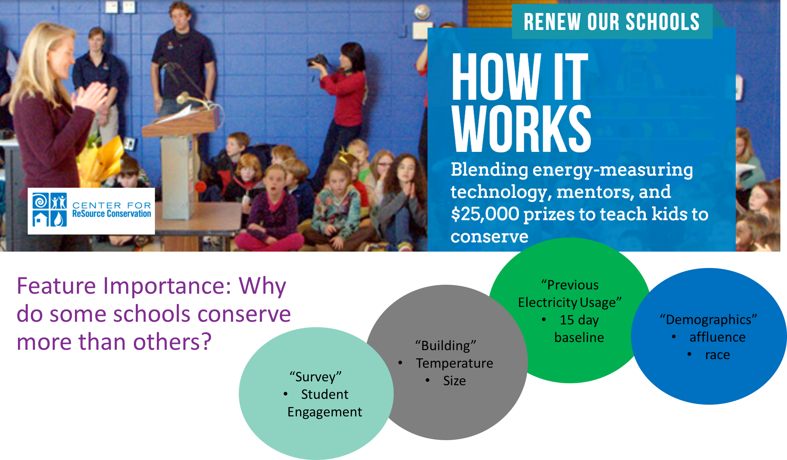
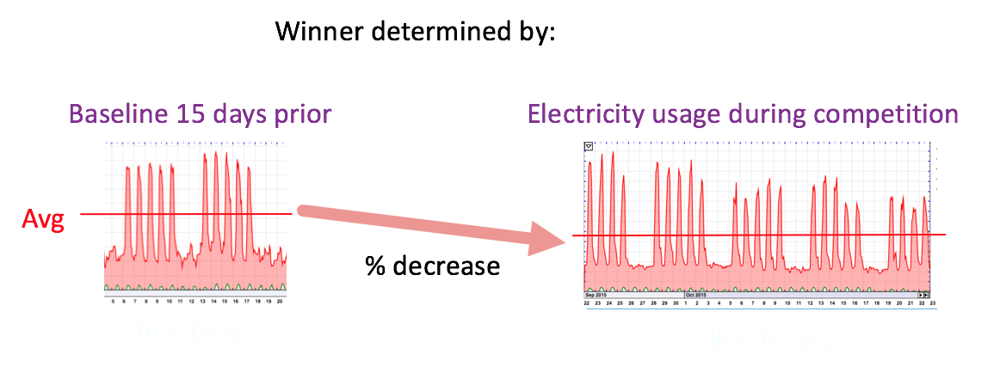

# Electricity Conservation
My Galvanize Capstone project

#### Main Idea:

Feature importance analysis and modeling was done to help understand why some schools conserve more electricity than others.

## Problem:

The Boulder, CO charity I partnered up with, Center for Resource Conservation (CRC) https://conservationcenter.org/ puts on a competition every few months where about 10 schools compete to see who can save the most electricity. They want to make sure the competition is fair and, from an environmental education point of view, are curious as to why some schools are more successful than others.

* more succinctly: Goal = Feature Importance!

