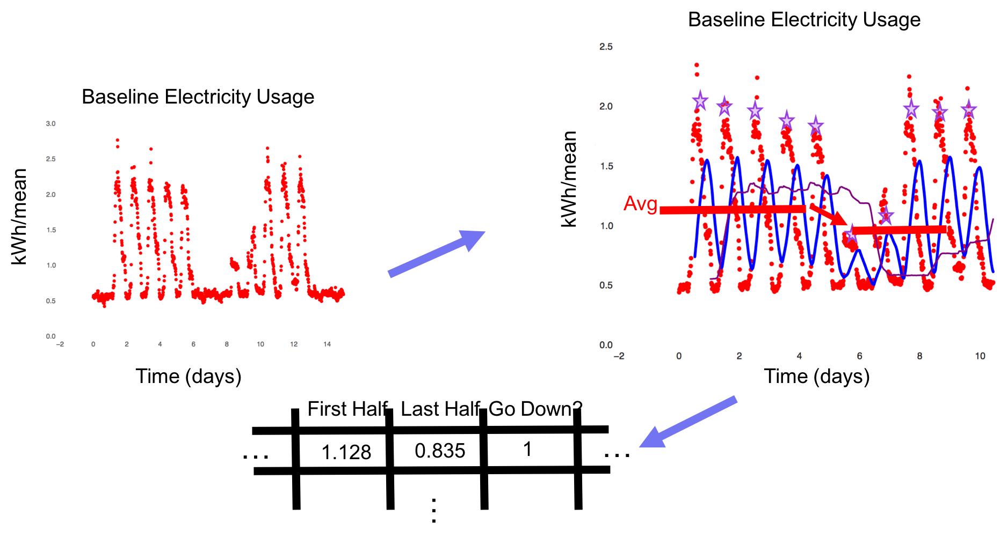
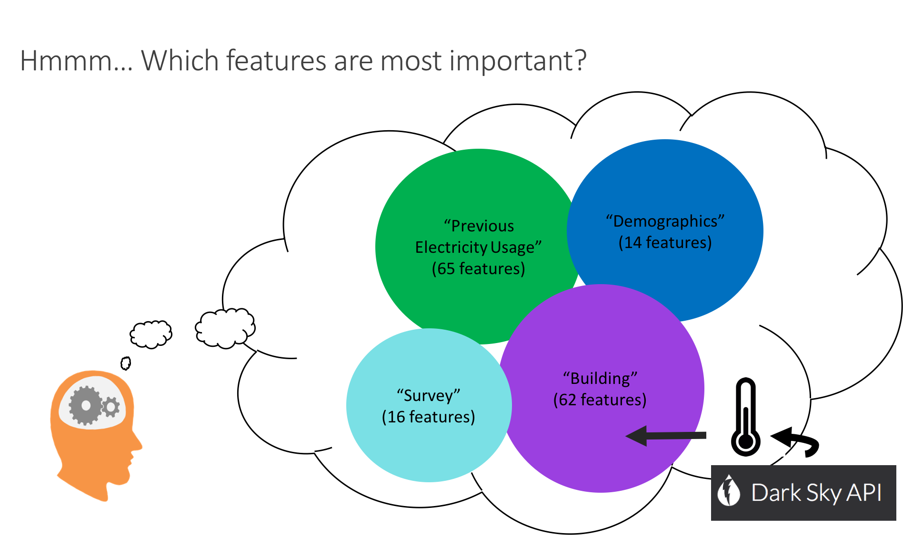
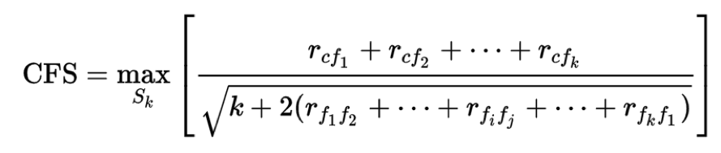
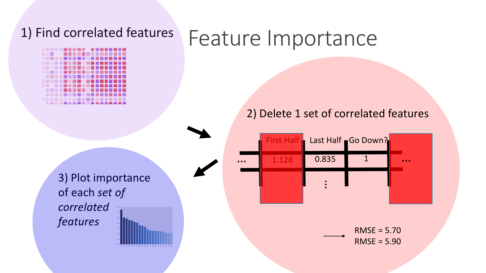
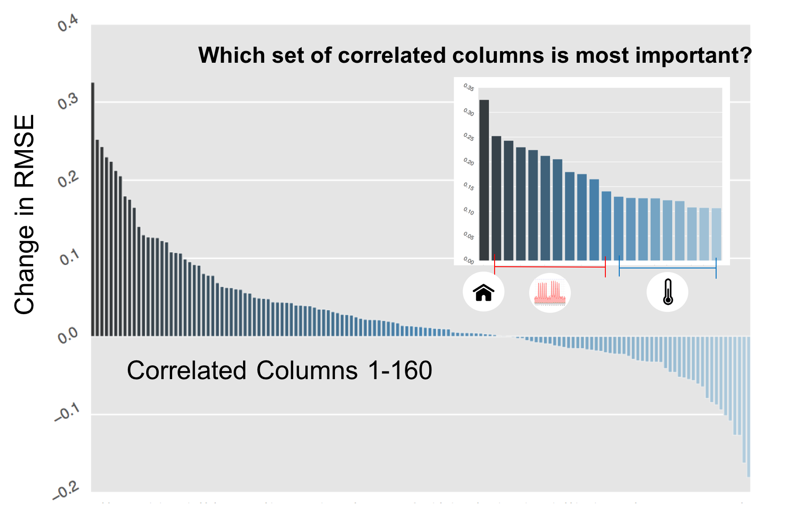
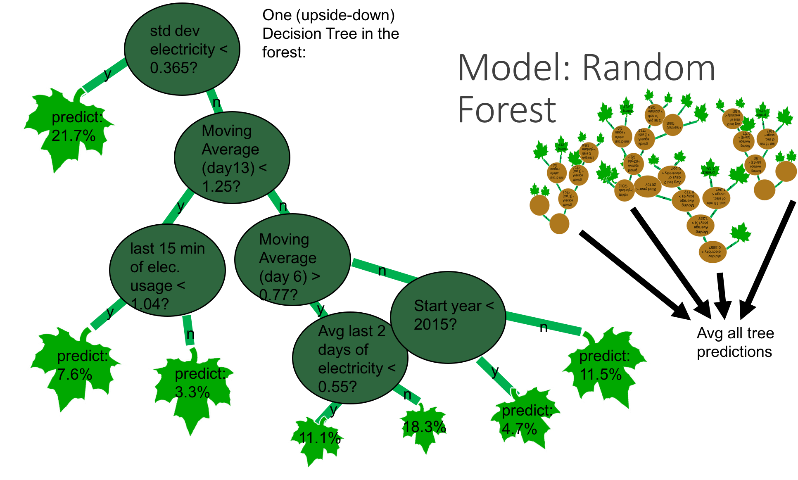
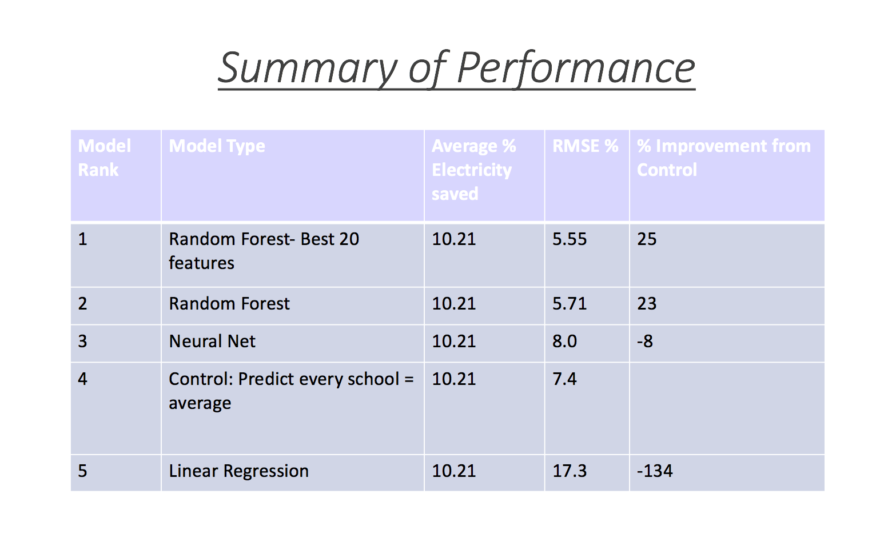
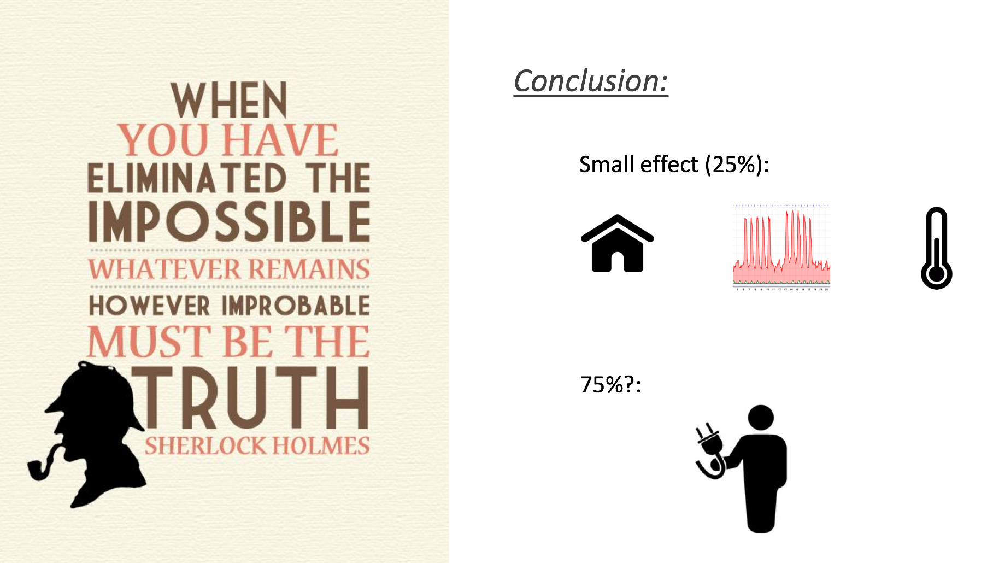

# Electricity Conservation
My Galvanize Capstone project

#### Main Idea:

Feature importance analysis and modeling was done to help understand why some schools conserve more electricity than others.

## Problem:

The Boulder, CO charity I partnered up with, Center for Resource Conservation (CRC) https://conservationcenter.org/ puts on a competition every few months where about 10 schools compete to see who can save the most electricity. They want to make sure the competition is fair and, from an environmental education point of view, are curious as to why some schools are more successful than others.

* more succinctly: Goal = Feature Importance!

## Feature Engineering

I started with 20 features and creatively engineered as many as I could. I ended up with 160 features.

The figure above shows how I made a feature looking at the average first half electricity usage in the 15 day period (after taking out the weekend). Another feature looks at the last half average, and another one writes a 1 if the last half electricity is lower than the first half.

I also made moving averages (shown as blue and purple lines), found the peaks of each day's electricity usage. All of these features are made in a python program I wrote called "preparingNN.py" (in the code folder).

## Feature Importance

I didn't like the results from using sklearn's feature importance attribute based on my random forest model, because the features with the most frequent splits aren't always the most important.

I didn't like the recursive elimination method because I have 1-10 features with multicollinearity, and so when I drop one feature, the other similar features still allow the model to run with a low RMSE.

I'm impressed with this method:

A correlation feature selection equation which punishes high values of multicollinearity in the denominator, and rewards features with high correlations to the classifier, c (the target, y). But it still is only looking at pair-wise interactions.

Expanding this to interactions of 10 features instead of 2 would have this many combinations: 160 chose 10 = 2.2 * 10^15 which would be computationally prohibitive.

Given this, and until I find better methods or code, I've invented my own method which I think works very well and am curious what others in data science think:

It is essentially a recursive elimination method, but eliminates all columns which have a high Pearson correlation value (> 0.6 or < -0.6 in my case).

Code for this fairly novel method is in code/feature_importance2.py

Here are the results:

The first column was "Avg last two days of electricity in the baseline" and was also highly correlated with the number of students and non-normalized average magnitude of electricity usage leading up to the competition. The data shows that the larger schools were at a slight disadvantage.

The next most important features were mostly the MA (moving averages) that I feature-engineered.

The least important features were temperature, but they were still significant.

Note: absent are survey data (too scant at this point... 90% NaNs) and demographics (didn't matter at all!)

This last non-result was very interesting to me... I think there is a commonly held notion that affluent, white communities (such as Boulder, CO) are more well-known for environmental activism, but my results show absolutely 0 correlation between either race or affluence (% of students in the schools on free and reduced lunch).

## Model: Random forest

The best-performing model was random forest. Here is an example of one tree in my random forest model, showing (in this example) that baseline electricity usage, indeed, was an important feature to split on:

## Results and Conclusion

Interestingly, after deleting all features but the top 20 from my feature importance, the RMSE improved, as shown below:

Finally, while I'm happy with the feature importance algorithm I wrote, the RMSE leaves more to be desired. I'm essentially missing something huge, and think it is probably student action data:

So I recommend to CRC to encourage all schools to keep a spreadsheet 'lab book' to keep track of daily activities the students and staff do to reduce electricity. It seems like those actions are the most important group of features! We won't know for certain until we can obtain said data.

## Contact Info:

If you've made it all the way to the bottom of this readme, congrats! I invite you to add me on linkedin and offer me a job if I don't have one haha.

I'm also very interested to receive some fan-mail or hate-mail about my feature importance algorithm.

https://github.com/lanceculnane

lanceculnane@gmail.com

https://www.linkedin.com/in/lanceculnane/

As an aside, I looked up the most-impactful demographic, and it happened to be "% of Hawaiians" (60th-most important feature out of 160). This is interesting to me because I lived in HI and know that their state motto etched into buildings is "The life of the land is perpetuated by/in righteousness" and they have a very strong environmental ethic. Their word for gold, kula, means 'source', as in a water-source, something they value.
